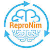
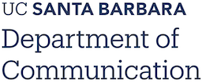

# COMM 160DS Syllabus (Spring 2023)

**Data Science in Communication: Python and Reproducible Research**

**Instructor:** Yibei Chen (yibeichen@ucsb.edu)

**Lectures:** Tuesdays/Thursdays 12\:30-1:45 pm (Arts Building, 1349)

**Office Hours:** Thursdays 2\:00-4:00 pm, SSMS \#4111

**Canvas:** [Link](https://ucsb.instructure.com/courses/7864) (Registered Students Only)

**JupyterHub:** [Link](https://comm160ds.lsit.ucsb.edu/hub/user-redirect/git-pull?repo=https%3A%2F%2Fgithub.com%2Fyibeichan%2FCOMM160DS&urlpath=lab%2Ftree%2FCOMM160DS%2F&branch=main)

**GitHub Classroom:** See link on Canvas or my email notification

**Pull your GitHub Repo to JupyterHub**: [nbgitpuller](https://hub.jupyter.org/nbgitpuller/link)

## Course Description:
This 10-week course introduces senior undergraduates in the Department of Communication to the fundamentals of data science using Python, focusing on reproducible research practices. Students will learn essential Python libraries, data visualization techniques, and principles of reproducible research to analyze and interpret data in the context of communication and social science research. By the end of the course, students will be able to apply these skills to a final project analyzing real-world communication data while ensuring their work is transparent, shareable, and reproducible.

## Course Structure: 
Weekly lectures on Tuesdays and Thursdays (1 hour and 15 minutes each), hands-on coding exercises, homework assignments, and a final group-project.
## Learning Objectives:

- How to **think** as a Data Scientist
- How to conduct work in a **Reproducible** way
- How to **use** Python packages not to develop packages/algorithms 
- How to **apply** learned skills to real world data

## Pre-Course Survey

Please take this [survey](https://forms.gle/dkTaauehBxCDqvpf8) before **04/04/2023**

<!-- This anonymous pre-course survey is designed to help us understand your current knowledge and experience in Python programming, data science, and reproducible research. Your responses will not impact your grades or standing in the course. The information collected will be used to tailor our teaching approach, ensure that the course content is relevant to your learning goals, and assess teaching outcomes. Thank you for your valuable input. -->

## Week 1: 

**Introduction to Data Science, Python, and Reproducible Research**

- Part 1: Welcome, course overview, and importance of data science in communication studies
- Part 2: Reproducible research principles, introduction to JupyterHub and Jupyter Notebook

**Lectures:** [Tuesday](week_1/lecture_part1.pdf) [Thursday](week_1/lecture_part2.pdf) 

**Readings:** [Link](Readings.md#week-1-introduction-to-data-science-python-and-reproducible-research)

**Assignment:** [Link](week_1/assignment.md)

## Week 2: 

**Python Data Structures, Functions, and Reproducible Code**

- Part 1: Python data structures: lists, tuples, dictionaries, and sets
- Part 2: Numpy, Python functions, and modules

**Lectures:** [Tuesday](week_2/lecture_part1.ipynb) [Thursday](week_2/lecture_part2.ipynb)

**Readings:** [Link](Readings.md#week-2-python-data-structures-functions-and-reproducible-code)

**In-class Exercise:** [Link](https://classroom.github.com/a/oTp1RJQ9)｜[Instruction](week_2/assignment.md#in-class-exercise-friday-04142023-night)

**Assignment:** [Link](week_2/assignment.md)

## Week 3: 

**Data Manipulation with Pandas and Data Provenance**

- Part 1: Introduction to Pandas library, data cleaning, and transformation
- Part 2: Data aggregation, data provenance, and reproducible data preparation workflows

**Lectures:** [Tuesday](week_3/lecture_part1.ipynb) [Thursday](week_3/lecture_part2.ipynb)

**Readings:** [Link](Readings.md#week-3-data-manipulation-with-pandas-and-data-provenance)

**In-class Exercise:** [Link](https://classroom.github.com/a/OQym4pEV)｜[Instruction](week_3/assignment.md#in-class-exercise-friday-04212023-night)

**Assignment:** [Link](week_3/assignment.md)

## Week 4: 

**Data Visualization with Matplotlib, Seaborn, and Reproducible Reporting**

- Part 1: Introduction to Data Visualization with Matplotlib and Advanced Visualization with Seaborn
- Part 2: Designing effective visualizations and reproducible reporting

**Lectures:** [Tuesday](week_4/lecture_part1.ipynb) [Thursday](week_4/lecture_part2.ipynb)

**Readings:** [Link](Readings.md#week-4-data-visualization-with-matplotlib-seaborn-and-reproducible-reporting)

**Assignment:** [Link](week_4/assignment.md)

## Mid-Course Survey

Please take this [survey](https://forms.gle/Vu7eb5Pn3EaJo7ZW9) before **05/04/2023**

<!-- This anonymous pre-course survey is designed to help us understand your current knowledge and experience in Python programming, data science, and reproducible research. Your responses will not impact your grades or standing in the course. The information collected will be used to tailor our teaching approach, ensure that the course content is relevant to your learning goals, and assess teaching outcomes. Thank you for your valuable input. -->

## Week 5: 

**Data Exploration and Introduction to NLP**

- Part 1: Descriptive statistics, Data exploration, and open science principles
- Part 2: Overview of text data analysis and introduction to NLP

**Lectures:** [Tuesday](week_5/lecture_part1.ipynb) [Thursday](week_5/lecture_part2.ipynb)

**Readings:** [Link](Readings.md#week-5-data-exploration-and-introduction-to-NLP)

**Assignment:** [Link](week_5/assignment.md)

## Week 6: 

**Intermediate Text Data Analysis, Social Media Data, and Natural Language Processing (NLP)**

- Part 1: Intermediate Text Data Analysis Techniques and Introduction to Social Media Data
- Part 2: Advanced Preprocessing Techniques and Natural Language Processing Applications for Social Media Datasets

**Lectures:** [Tuesday](week_6/lecture_part1.ipynb) [Thursday](week_6/lecture_part2.ipynb)

**Readings:** [Link](Readings.md#week-6-intermediate-text-data-analysis-social-media-data-and-natural-language-processing)

**Assignment:**  [Link](week_6/assignment.md)

## Week 7: 

**Sentiment Analysis and Reproducible Text Analysis in Communication Research**

- Part 1: Reproducibile Sentiment Analysis using Social Media Data
- Part 2: Q&A Session

**Lectures:** [Tuesday](week_7/lecture_part1.ipynb) [Thursday](https://forms.gle/7fjqtLqLw7ktYYwu7)

**Readings:** [Link](Readings.md#week-7-sentiment-analysis-and-reproducible-text-analysis-in-communication-research)

**Assignment:** None

## Week 8: 

**Topic Modeling and In-depth Exploration of Text Analysis Techniques**

- Part 1: Introduction to topic modeling and implementing topic modeling techniques
- Part 2: In-depth exploration and discussion of sentiment analysis, topic modeling, and reproducible workflows

**Readings:** TBD

## Week 9: 

**Network Analysis and Reproducible Data Collection**

- Part 1: Introduction to network analysis and analyzing pre-collected network data
- Part 2: Visualizing network graphs, ensuring reproducibility, and reproducible data collection strategies

**Readings:** TBD

## Week 10: 

**Final Project Workshop, Presentations, and Course Wrap-up**

- Part 1: Final project workshops, peer feedback sessions, and presentations of preliminary project results
- Part 2: Discussing challenges, lessons learned, course wrap-up, and next steps in data science for communication research

**Readings:** TBD

## Acknowledgement 

 

## Contribution

The current repo is created and maintained by Yibei Chen with the assistance of ChatGPT. Feel free to open an PR if you identify any errors. You are welcome to use/fork this repo for your own course. 
