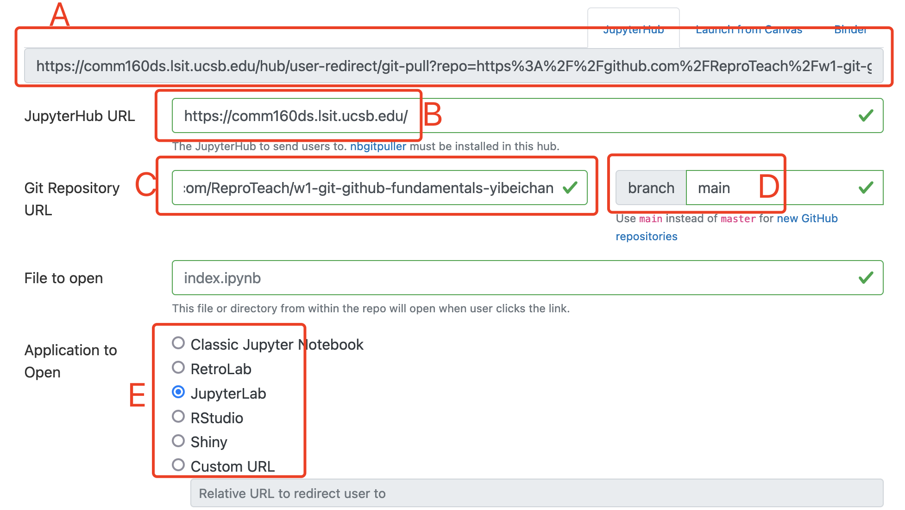

# Week 1 Assignment (Due: 04/11/2023 Midnight)

## 1. Create Your GitHub Account

[Signing up for a new (free) GitHub account](https://docs.github.com/en/get-started/signing-up-for-github/signing-up-for-a-new-github-account) use your UCSB email (the same you used to enroll in the class). If you use `@ucsb.edu`, add `@umail.ucsb.edu` to your account as well, see this [link](https://docs.github.com/en/account-and-profile/setting-up-and-managing-your-personal-account-on-github/managing-email-preferences/adding-an-email-address-to-your-github-account).

Get the [Student Developer Pack](https://education.github.com/pack)

## 2. DataCamp assignment (5%)

1. Accept the link in my email
2. Finish the two assignments (GitHub and Git) 
3. (04/07/23 updated) Add one more assignment (the whole course about Git)

## 3. GitHub Classroom assignment (1%)

1. Accept the link in my email and then you will find your own repo with your GitHub username as suffix [here](https://github.com/orgs/ReproTeach/repositories) (you can use the search bar to find it). Go to your repo and open it
2. Pull GitHub Repo to JupyterHub using [nbgitpuller](https://hub.jupyter.org/nbgitpuller/link)


    - put our JupyterHub link at **B**
    - put your repo url, which should have your username as suffix, at **C**
    - type `main` at **D**
    - choose `JupyterLab` at **E**
    - copy the link from **A** and open it in a new window, here you go
    - if you encounter any issues, go back and check every step
    - if you still have issues, post it on Nectir or discuss it with your study group
    - there has been serveral network outages on campus recently; so if you can't open link **A** AND our JupyterHub, don't worry about it. Just wait for a few hours and try again
3. Ignore the original task in the repo, our assignment will be (1) add a new Jupyter notebook in the repo and (2) add a `.gitignore` file
    - add a jupyter notebook and name it as `week1.ipynb`
    - open a new terminal and type `git status`
    - if you find `.ipynb_checkpoints/`, type `rm -r .ipynb_checkpoints/` to remove it
    - `git status` again to see whether you've successfully removed it
    - if so, type `git add` to add your `week1.ipynb`
    - then type `git commit -m "write any messages here"` if this is your first time doing so, you will need to type the following one by one
        ```
        git config --global user.name "yourusername"
        git config --global user.email "yourgithubemail@example.com"
        ```
    - type `git commit -m "write any messages here"` again, if no error, yayyy, your git config set up successfully
    - type `git push`, it will ask for your username and password. After you type your password, you will see errors, follow the first answer [here](https://stackoverflow.com/questions/68788998/authentication-was-removed-please-use-a-personal-access-token-instead) to generate a SSH key and use it as your password.
        note: when you type the password for `git push` everything is invisible so copy & paste your SSH token and click `return`. If you type something wrong, click `return`, it will let you do it again.
    - create a `.gitignore` file following this [link](https://coursework.vschool.io/create-a-gitignore/) and add `.ipynb_checkpoints/` to your `.gitignore`